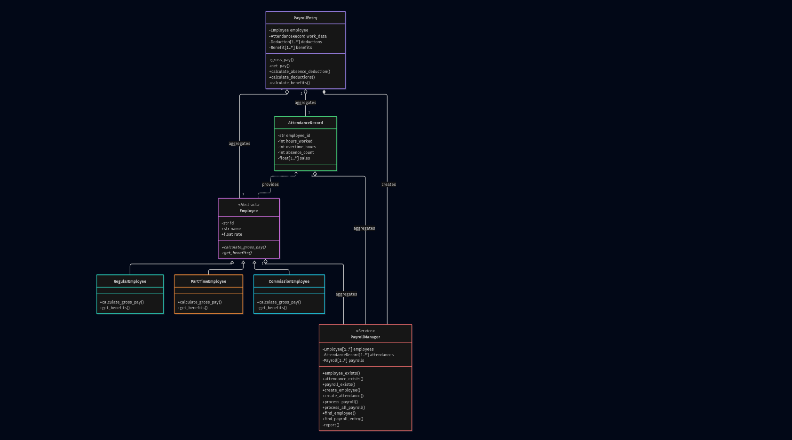
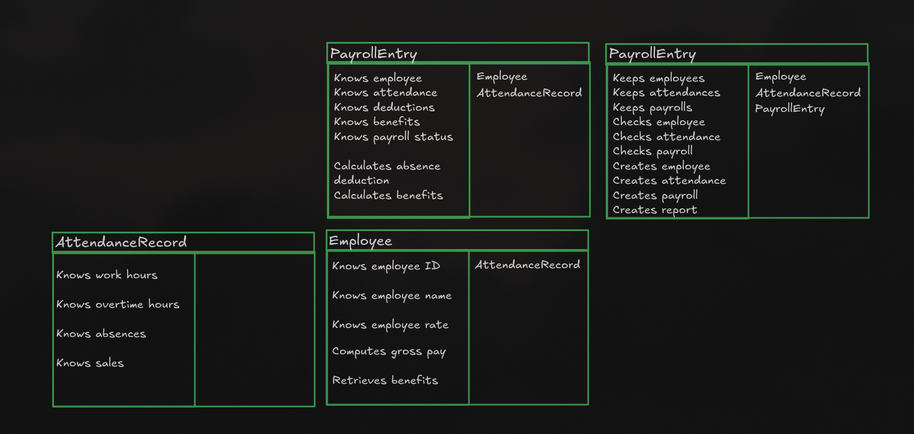
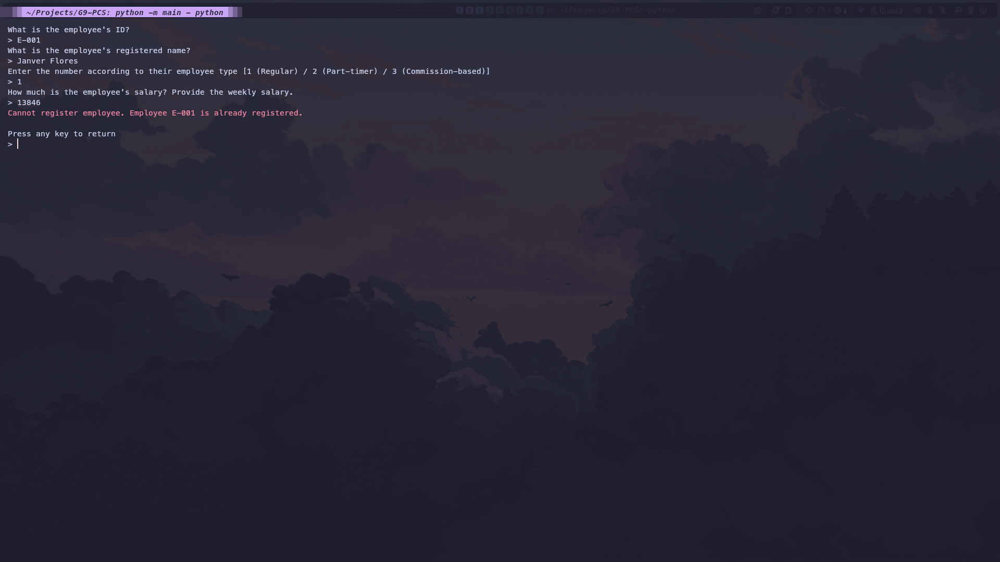

# G9-PCS

A payroll and compensation system by Group 9. A python activity.

## System Overview

The Payroll and Compensation System is a console-based application developed to
manage employee information, attendance records, payroll processing, and compensation
reporting. The system is intended for payroll administrators or human resource personnel who
are responsible for maintaining employee records and ensuring accurate salary computation.
Through a menu-driven interface, users can efficiently perform payroll-related tasks while
maintaining data integrity through validation and exception handling.
The primary purpose of the system is to automate payroll calculations for different
employee types. The system supports three employee types: Regular Employees, Part-Time
Employees, and Commission-Based Employees. Each employee type follows a specific
compensation model, allowing the system to compute payroll accurately according to the
employee's work arrangement.

The system provides several major operations. Users can register new employees by
providing their employee ID, name, employee type, and salary details. Attendance records can
then be created to store work hours, overtime hours, absences, or sales information depending on
the employee type. Payroll can be processed individually for a specific employee or
automatically for all employees with recorded attendance. The system also supports employee
searching through employee IDs, payslip generation, payroll history viewing, and comprehensive
payroll reporting.

Several business rules are enforced to ensure reliability and prevent invalid transactions.
Employee IDs must be unique and employee names cannot contain numbers or special
characters. Salary values, work hours, overtime hours, absences, and sales amounts must be valid
numeric values. Attendance records cannot be created for non-existent employees. Payroll
cannot be processed without a corresponding attendance record, and duplicate payroll processing
is prevented. The system also validates employee-specific information such as overtime and
absences for regular employees and sales records for commission-based employees.

The application follows the Model-View-Controller (MVC) architecture to improve
organization and maintainability. The Model layer manages employee, attendance, payroll, and
exception classes. The View layer handles , while the Controller layer coordinates business logic
and payroll processing . By applying object-oriented programming principles such as abstraction,
encapsulation, inheritance, polymorphism, and exception handling, the system provides a scalable
and maintainable solution for payroll management and compensation tracking.

## Class Diagram

## Class Responsbility Table / CRC Card

## Test Cases

| Test ID | Test Objective                                 | Input                                                                                                                                                                   | Expected Result                                                                        | Actual Result                                                                          | Status |
| :-----: | :--------------------------------------------- | :---------------------------------------------------------------------------------------------------------------------------------------------------------------------- | :------------------------------------------------------------------------------------- | :------------------------------------------------------------------------------------- | :----: |
|    1    | Register at least 3 employees                  | RegularEmployee(id="E-001", name="JF FJ", rate=45000), PartTimeEmployee(id="E-002", name="SA CU", rate=67000), CommissionEmployee(id="E-003", name="VN YA", rate=35000) | Registered employees will be added to the collection                                   | Registered employees were added to the collection                                      |  Pass  |
|    2    | Reject an employee with an existing ID         | Employee ID: "E-001"                                                                                                                                                    | Halt operation and show an error message                                               | Halted operation and showed an error message                                           |  Pass  |
|    3    | Record valid work data                         | Employee ID: "E-001", Hours worked: 42, Overtime hours: 2, Absences: 0                                                                                                  | Operation will register work data for the employee and show a success message          | Operation registered work data for the employee and displayed a success message        |  Pass  |
|    4    | Reject impossible hours                        | Work hour: -45                                                                                                                                                          | Operation will not proceed and will show an error message about the minimum work hours | Operation did not proceed and showed an error message about the minimum work hours     |  Pass  |
|    5    | Process one payroll per employee type          |                                                                                                                                                                         |                                                                                        |                                                                                        |  Pass  |
|    6    | Reject payroll for employees without work data | Employee ID: "E-001"                                                                                                                                                    | Operation halts and will show an error message about insufficient data                 | Operation did not proceed and showed an error message about insufficient employee data |  Pass  |
|    7    | Reject duplicate payroll processing            |                                                                                                                                                                         |                                                                                        |                                                                                        |  Pass  |
|    8    | Generate payslip and verify computations       |                                                                                                                                                                         |                                                                                        |                                                                                        |  Pass  |

## Screenshots

_Screenshot of main view displaying the different operations available_

_Screenshot of the register view with a successful operation_

_Screenshot of the attendance record view with a successful operation_

_Screenshot of the payroll view for an employee with a successful operation_

_Screenshot of the payroll view for every employee with a successful operation_

_Screenshot of the search view with a successful operation_

_Screenshot of the payslip view with a successful operation_

_Screenshot of the payslip histor with a successful operation_

_Screenshot of the report view with a successful operation_

_Screenshot of the exit view_

_Screenshot of the register view with an invalid operation_

_Screenshot of the search view with an invalid operation_

## Reflection
